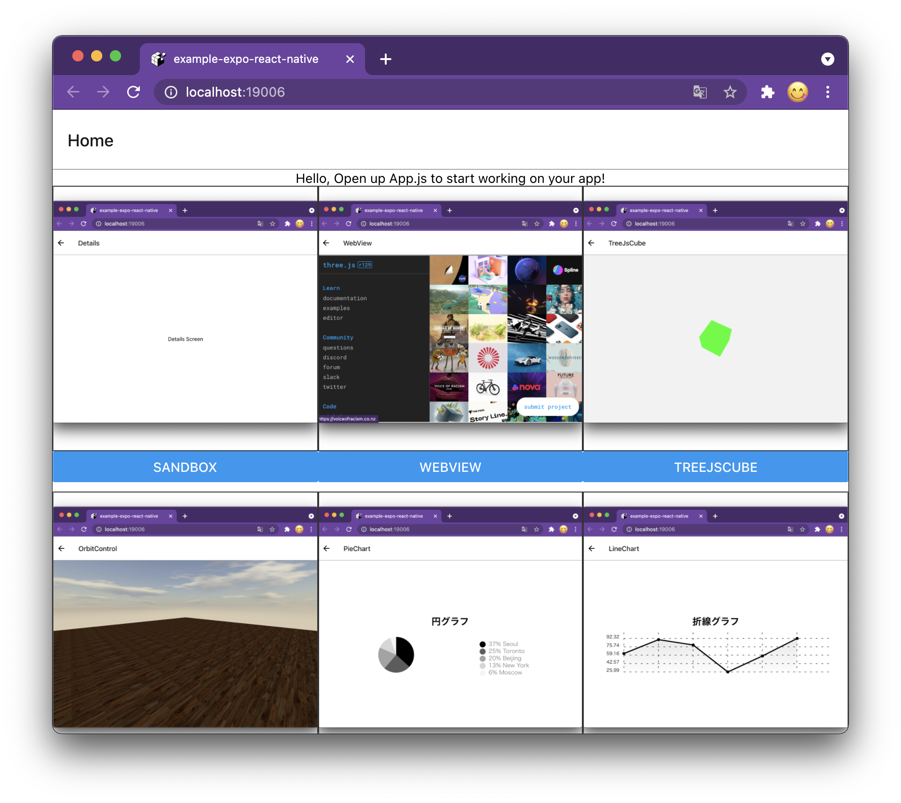
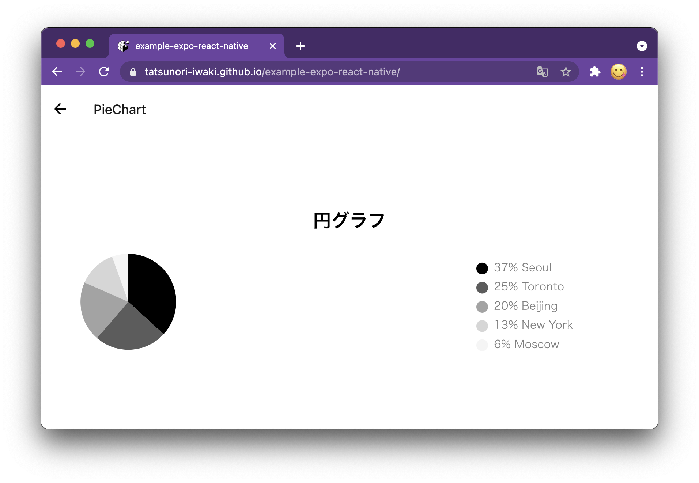
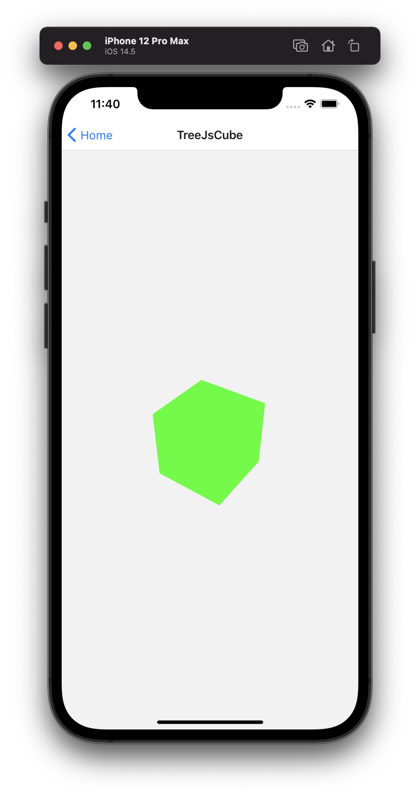
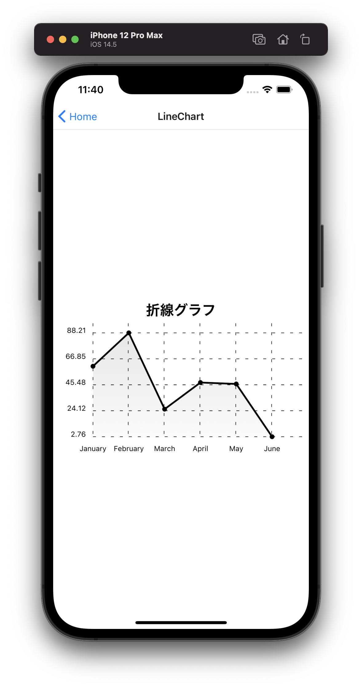

<h1 align="center">
   
  
   
  Expo react native, chart-kit, three-js examples.
   
</h1>
<h4 align="center">
   Cross-platform. Expo is a service that supports the build and development of React Native.
   Three.js is a JavaScript library that makes it easy to create 3D (WebGL) content.
   Graphs can be easily implemented using react-native-chart-kit.
   Here's a simple example using the JavaScript library.
   
   
</h4>

# live demo
https://tatsunori-iwaki.github.io/example-expo-react-native/

# screen shots

